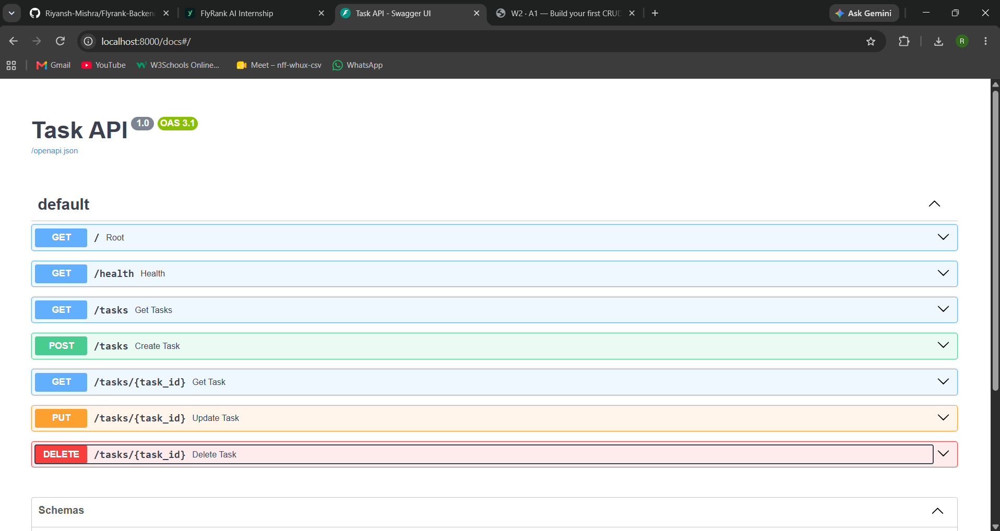
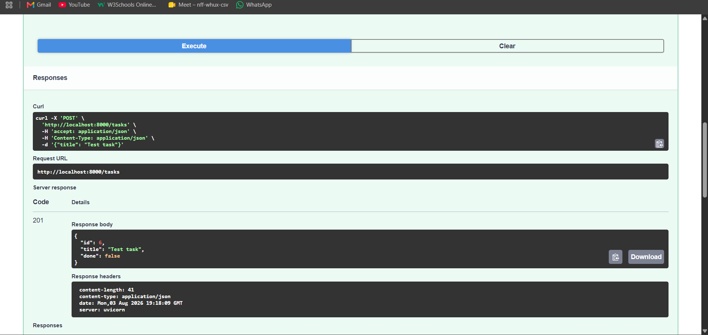
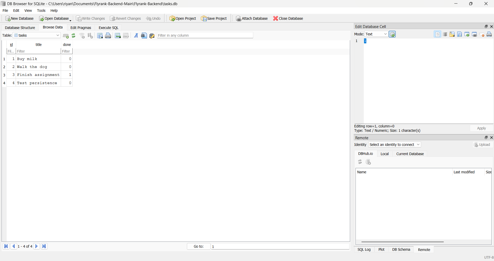
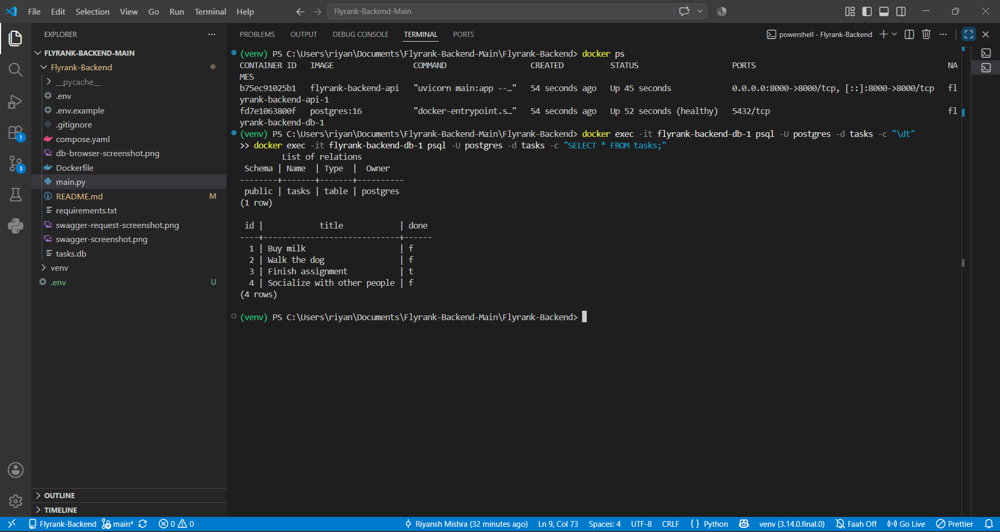
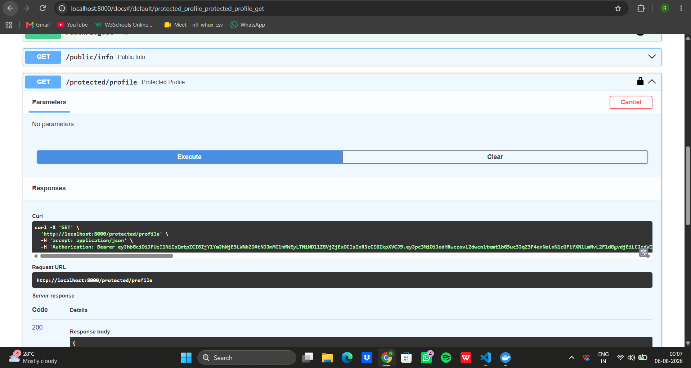

# Task API

A CRUD (Create, Read, Update, Delete) API for managing a to-do list, built with FastAPI. Originally used in-memory storage (Week 2); now uses a SQLite database (Week 3) so data survives server restarts.

## How to run

1. Clone this repo and enter the folder:
```bash
   git clone https://github.com/<your-username>/todo-crud-api.git
   cd todo-crud-api
```
2. Create a virtual environment and activate it:
```bash
   python3 -m venv venv
   source venv/bin/activate   # Windows: venv\Scripts\activate
```
3. Install dependencies and run:
```bash
   pip install fastapi uvicorn pydantic
   uvicorn main:app --reload
```
4. Server runs at `http://localhost:8000`. Interactive docs (Swagger UI) at `http://localhost:8000/docs`.
5. On first run, `tasks.db` is created automatically with 3 seeded example tasks.

## Endpoints

| Method | Path            | Description                  | Success | Errors        |
|--------|-----------------|-------------------------------|---------|---------------|
| GET    | `/`             | API info                      | 200     | —             |
| GET    | `/health`       | Health check                  | 200     | —             |
| GET    | `/tasks`        | List all tasks                | 200     | —             |
| GET    | `/tasks/{id}`   | Get one task                  | 200     | 404           |
| POST   | `/tasks`        | Create a task                 | 201     | 400           |
| PUT    | `/tasks/{id}`   | Update a task                 | 200     | 400, 404      |
| DELETE | `/tasks/{id}`   | Delete a task                 | 204     | 404           |
| GET    | `/stats`        | Task counts                   | 200     | —             |

## Example request

```bash
$ curl -i -X POST http://localhost:8000/tasks -H "Content-Type: application/json" -d '{"title":"Buy milk"}'

HTTP/1.1 201 Created
content-type: application/json

{"id":4,"title":"Buy milk","done":false}
```

## Swagger UI (Week 2)




## Database (Week 3)

**Why SQLite?** It's a single-file, zero-setup database — no server to install or run, just a file called `tasks.db` that's created automatically the first time the app starts. Perfect for a small project like this, and a natural stepping stone before a "real" server-based database like Postgres.

**Where the database lives:** `tasks.db`, created automatically on first run. It's git-ignored, so every fresh clone starts with an empty database that self-seeds 3 example tasks.

**Example query I ran in DB Browser:**
```sql
UPDATE tasks SET done = 1;
```
This marked every task as completed — confirmed instantly through `GET /tasks` with no server restart needed, since the API and DB Browser read the same file.



## Notes

- Week 2: data was in-memory only — restarting the server reset all tasks. That was intentional, to show the limits of memory-based storage.
- Week 3: data now persists in SQLite (`tasks.db`) — restarting the server no longer loses data. Tested by creating tasks, restarting, and confirming they're still present via both the API and DB Browser.

## Database (Week 1 · A3 — Postgres in Docker)

**Why Postgres + Docker?** SQLite was a single file — fine for small local projects, but real backends (including FlyRank's) run PostgreSQL as its own server. Docker lets you run that server without installing or configuring Postgres directly on your machine — the exact same container works identically on any computer.

**How to run the whole stack:**
```bash
cp .env.example .env
docker compose up
```
This starts both the API and the Postgres database together. On first run, the `tasks` table is created and seeded automatically.

**Environment variables** (see `.env.example`): `DATABASE_URL` — the connection string the app uses to reach Postgres.

**Example query:**
```sql
SELECT * FROM tasks;
```
Returns all seeded and created tasks, confirmed live in psql.



## Notes (updated)

- Week 2: in-memory storage, lost on restart.
- Week 3 (A2): SQLite file, survives restarts, single file on disk.
- Week 1 (A3): PostgreSQL running in Docker, survives full container restarts thanks to a named volume (`taskdata`). Tested by creating a task, running `docker compose down` (removes containers) and `docker compose up` again — task was still present.

## Authentication (Week 2 · A4 — Supabase Auth)

**Why Supabase Auth?** Rolling your own password hashing and token signing is risky and unnecessary — Supabase (an Identity Provider) handles account storage, password hashing, and signing JSON Web Tokens (JWTs) for you. This app never touches a raw password beyond forwarding it to Supabase, and never stores one.

**How it works:** a user signs up or logs in through Supabase, which returns a signed access token (JWT). The client sends that token on every request to a protected route via the `Authorization: Bearer <token>` header. The server asks Supabase to verify the token before running the route — this is handled by a single reusable guard (`get_current_user`), applied to every protected route via FastAPI's `Depends(...)`.

**Setup:** create a free project at [supabase.com](https://supabase.com), then under **Project Settings → API** copy your Project URL and `anon` public key (never the `service_role` key) into your own `.env` file:

SUPABASE_URL=your_supabase_project_url
SUPABASE_KEY=your_supabase_anon_key

For local testing, also turn off "Confirm email" under **Authentication → Sign In / Providers → Email**, so test signups can log in immediately.

## Endpoints (updated)

| Method | Path                    | Description                  | Auth required | Success | Errors        |
|--------|-------------------------|-------------------------------|----------------|---------|---------------|
| GET    | `/`                     | API info                      | No             | 200     | —             |
| GET    | `/health`               | Health check                  | No             | 200     | —             |
| GET    | `/public/info`          | Public info                   | No             | 200     | —             |
| POST   | `/auth/signup`          | Create a new account          | No             | 201     | 400           |
| POST   | `/auth/login`           | Log in, get a JWT             | No             | 200     | 400, 401      |
| POST   | `/auth/logout`          | End the session                | Yes            | 204     | 401           |
| GET    | `/protected/profile`    | Get your own user info         | Yes            | 200     | 401           |
| GET    | `/protected/dashboard`  | Protected demo route           | Yes            | 200     | 401           |
| GET    | `/tasks`                | List all tasks                 | No             | 200     | —             |
| GET    | `/tasks/{id}`           | Get one task                   | No             | 200     | 404           |
| POST   | `/tasks`                | Create a task                  | No             | 201     | 400           |
| PUT    | `/tasks/{id}`           | Update a task                  | No             | 200     | 400, 404      |
| DELETE | `/tasks/{id}`           | Delete a task                  | No             | 204     | 404           |
| GET    | `/stats`                | Task counts                    | No             | 200     | —             |

## Swagger UI with bearer auth

After logging in, paste the returned `access_token` into Swagger's **Authorize** button (padlock icon, top right of `/docs`). Once authorized, protected routes can be called directly from the browser with no manual headers needed:



## Notes (updated)

- Week 2 (A1): in-memory storage, lost on restart.
- Week 3 (A2): SQLite file, survives restarts.
- Week 1 (A3): PostgreSQL in Docker, survives full container restarts via a named volume.
- Week 2 (A4): added authentication via Supabase — signup, login, logout, and protected routes guarded by a single reusable token-verification dependency. Passwords are never stored or hashed by this app; Supabase handles that entirely.!